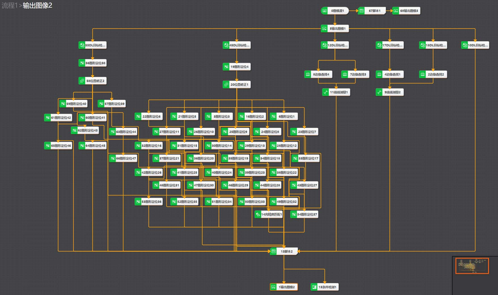
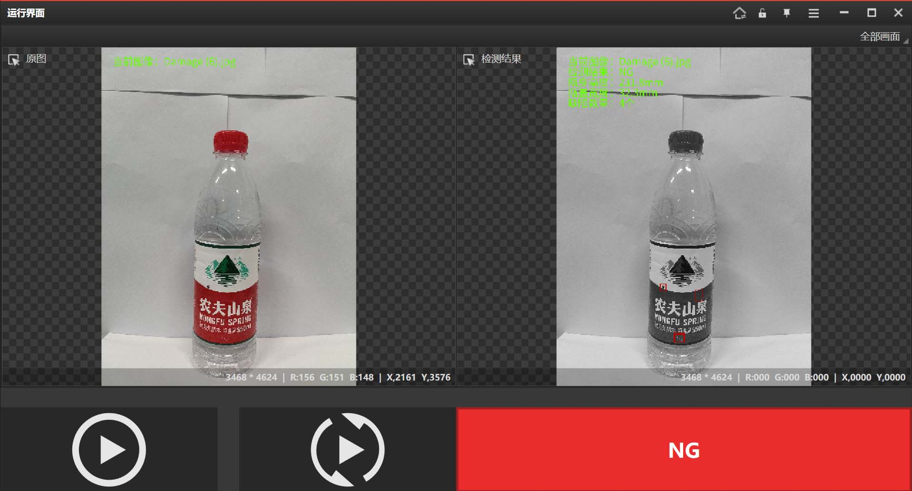

# 💧 农夫山泉产线缺陷检测视觉验证系统 (POC)

基于海康 VisionMaster 与 VisionTrain 深度学习平台的工业缺陷检测混合架构落地方案。
本项目为第四届“海康启智杯”机器智能大赛（应用赛道）参赛项目。

📑 **[点击此处下载完整《技术报告》PDF](./Technical_Report.pdf)**  
*(注：若 GitHub 网页端无法直接预览，请点击页面右上角的 `Download raw file` 按钮下载后查看)*

---

## 🎯 项目背景与挑战
针对流水线农夫山泉矿泉水瓶的高速运动特性、曲面包装的严重反光问题，以及划痕、异物、液位异常等复杂缺陷形态，传统单一的机器视觉算法误判率极高。本项目旨在设计一套**“高鲁棒性、高检出率”**的自动化光学检测（AOI）落地方案。

## 🚀 核心架构与创新点

### 1. 混合检测架构设计
摒弃传统单一算法，创新设计 **“DL 目标检测粗定位 + 传统边缘/图形匹配精定位”** 的混合检测架构。有效克服了曲面反光与字符扭曲带来的干扰，极大提升了算法鲁棒性。

### 2. 硬件选型与光学方案设计
* **相机选型**：为消除流水线高速运动带来的“果冻效应”拉伸拖影，选用 **全局快门 (Global Shutter)** 工业相机。
* **镜头测算**：基于实际视野 (FOV) 与工作距离 (WD)，精确测算并选配对应焦距的工业镜头。
* **光学打光**：针对瓶盖与透明瓶身的极强反光，规划 **同轴光 + 低角度环形光** 组合打光方案，实现缺陷特征的最大化凸显。

### 3. 自适应 ROI 优化与显存控制
* **异常状态反馈机制**：逆向利用失败算子的 ROI 输出作为缺陷标记框，省去了复杂的逻辑判断代码。
* **自适应裁图**：结合深度学习粗定位的坐标进行自适应区域裁图，过滤冗余背景，为后续边缘部署的显存优化提供了可靠依据。

---

## 📊 性能表现与商业验证
* **检测耗时**：单次整体流程推理耗时 **< 200ms**。
* **检出率**：在自建测试集上，针对微小划痕、脏污的检出率达到 **> 99%**。
* **结论**：验证了该混合架构在实际严苛质检场景中替代人工的可行性与应用潜力。

---

## 📸 运行效果演示

---

## 📥 方案获取与复现 (Download & Run)

为了方便复现，本项目的完整 VisionMaster 方案文件（.sol）、训练好的深度学习模型（.bin）以及完整的测试数据集已打包上传至云盘。

🔗 **百度网盘下载链接**：
* 链接：[https://pan.baidu.com/s/1aRMEWMyYClpdtHNLpBj3Qw]
* 提取码：`1234` (填写你的提取码)

**环境要求**：
* 海康 VisionMaster V4.4.0 
* 海康 VisionTrain V2.3
* 海康线上训练平台 https://124.160.120.221